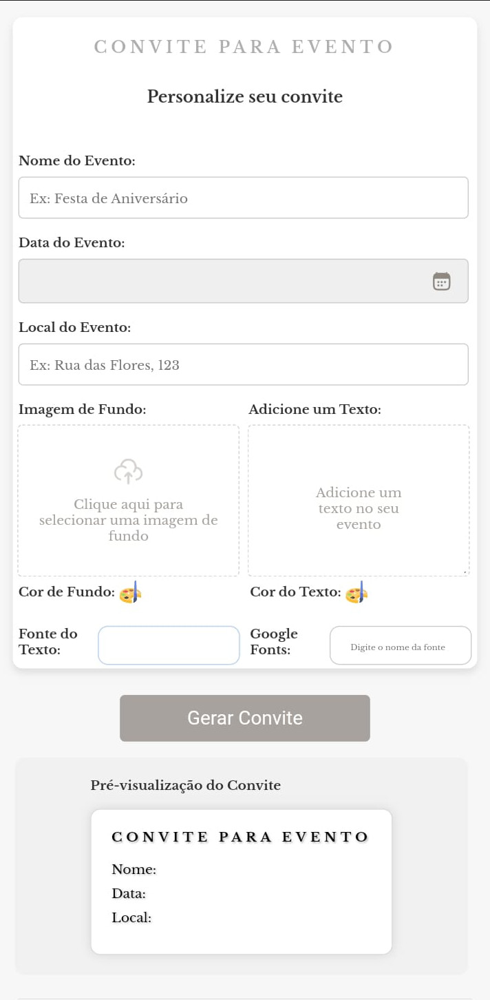

<h1 align="center"><strong>Convite para Evento</strong></h1>

  

## 🚀 Tecnologias

Esse projeto foi desenvolvido com as seguintes tecnologias:

-   

- 

- 

- 

- 

## 💻 Projeto

Este projeto, desenvolvido com as tecnologias HTML, CSS e JavaScript, oferece uma interface intuitiva para a criação de convites personalizados para diversos tipos de eventos.

## Conclusão:

O gerador de convites personalizados é um projeto versátil e prático que demonstra a aplicação das tecnologias HTML, CSS e JavaScript na criação de ferramentas web interativas e personalizadas. Ao permitir que os usuários criem convites únicos e exclusivos, este projeto oferece uma solução simples e eficaz para uma necessidade comum.

- Acesse o projeto finalizado, [online]()

---

Developed by Bruno Teixeira :wave: [siga!](https://www.instagram.com/bruno_txrs/)
